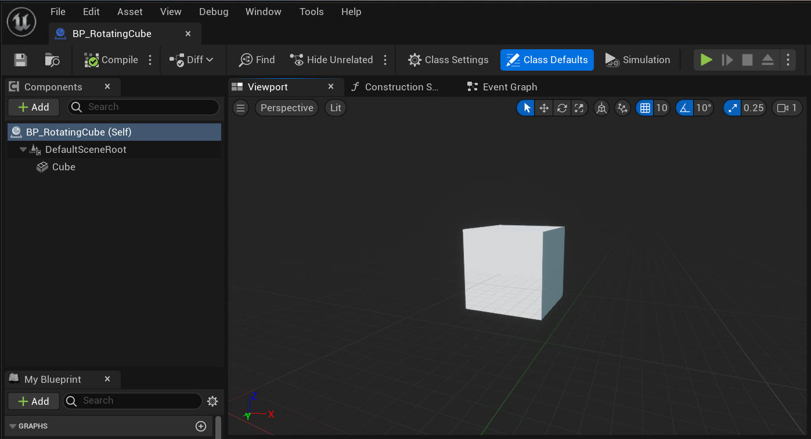

# 练习六：添加一个旋转的方块

在许多射击游戏里，都能看到那些放在宝箱里或者悬浮在半空中的枪械，就像这样：

<figure><figcaption>
游戏中可拾取的枪械
</figcaption></figure>

我们也可以做到，只是要先从简单的开始，例如一个在空中旋转的方块：

<figure><figcaption>
旋转的方块
</figcaption></figure>

你只需要创建一个StaticMeshActor（静态网格物体），并用蓝图控制它的旋转即可。但在开始前，还是需要简单的介绍一下什么是Actor。

## Actor是什么？

官方文档里对Actor的定义是：所有可以放入关卡的对象都是 Actor。例如我们在练习三里添加的方形平台就是一个Actor：

<figure><figcaption>
练习三加入的Cube
</figcaption></figure>

在大纲窗口中就可以看到关卡中每个物品的Type（类别）。具体来说，这个Cube的类别叫做StaticMeshActor，它是Actor的一个子类，是指所有包含静态网格模型的对象。


如果你还不熟悉C++的**父类、子类**的概念，可以用生物学的分类来帮助理解。例如犬科是一种动物类别，而狗、狼、豺和狐狸都是它的子类。而狗又有它自己的子类，例如哈士奇、金毛、吉娃娃等。父类描述了所有子类的共性，而子类则包含更具体的特性。



如果你熟悉Unity引擎，Unity中的GameObject和虚幻引擎中的Actor是非常相似的概念。


## 添加一个旋转的方块

1.  新建一个蓝图类\
    在虚幻5的编辑器中，很多时候有多种方式来完成同样的操作。例如新建蓝图类，可以采用以下几种方式。\
    一、在**内容菜单**空白处点击右键，选择Blueprint Class

    <figure><figcaption>
右键菜单中的Blueprint Class
</figcaption></figure>

    二、**内容菜单**里点击Add（添加）按钮后选择Blueprint Class

    <figure><figcaption>
内容菜单里的添加按钮
</figcaption></figure>

    三、点击**主工具栏**里的Blueprint（蓝图）-> New Empty Blueprint Class （新建空白蓝图类）

    <figure><figcaption>
主工具栏中的蓝图按钮
</figcaption></figure>
2.  选择新建蓝图的父类\
    无论是采用上述三种方法中的哪一个，都会弹出这个选择父类的窗口。在这里我们选择第一个选项——Actor。因为我们想要添加的是一个可以**放在关卡中**的旋转方块。

    <figure><figcaption>
选择新建蓝图类的父类
</figcaption></figure>
3.  给蓝图类命名\
    在上一步点击Actor以后，内容菜单里会出现一个新的蓝图类并等待你输入这个蓝图类的名称。在官方的最佳编码实践中说过，建议用"BP\_"作为蓝图类的前缀（BP是Blueprint的缩写）。这样做的好处是可以很容易分辨内容菜单里每一项的类型。而且最好让每个类的名字能够准确的反映它所提供的内容或功能，比如BP\_RotatingCube就是一个不错的选择。\

    <figure><figcaption>
添加到内容菜单里的新建蓝图类BP_RotatingCube
</figcaption></figure>
4.  在**蓝图编辑器**中添加一个方块\
    在内容菜单中双击新建的BP\_RotatingCube，就会打开一个新的窗口——**蓝图编辑器**。

    <figure><figcaption>
蓝图编辑器
</figcaption></figure>

    蓝图编辑器中同样有一个非常类似的Add（添加）按钮，里面同样包含着Cube选项。点击Cube后，屏幕中央的三维视图里就会多出来一个方块。\
    编译和保存当前改动后，我们就可以暂时先关掉蓝图编辑器回到之前的界面。\
    复习：在练习五里编辑关卡蓝图后，我们也做过同样的编译和保存操作。所有对于蓝图的改动都要在编译后才会生效，所以今后在完成蓝图的改动想要回到主界面去测试的时候，也要记得编译和保存。
5. 在场景中加入新建的蓝图类\
   要在关卡中加入刚建立的蓝图类，只需要从内容菜单中将它拖拽到场景里就可以了。\
   
6. 在蓝图中实现方块的旋转\
   接下来就到了这个练习最核心的部分，通过蓝图编程实现旋转的功能。
