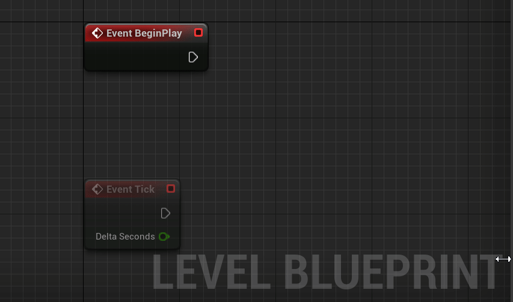
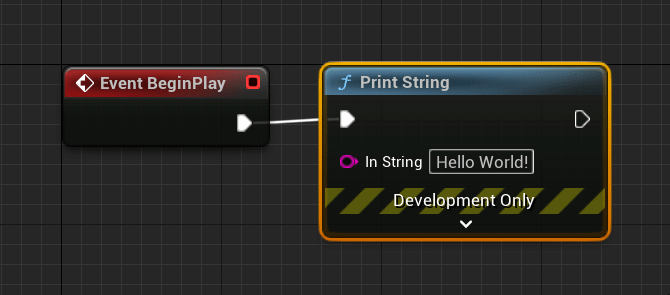
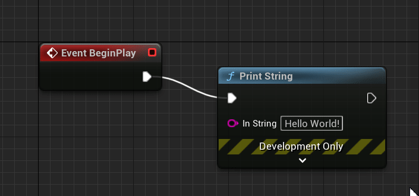

# 练习五：蓝图打印Hello world!

虽然我真的很想让你早点开始做有趣的游戏内容，但为了多一点点机会再熟悉下虚幻引擎的界面以及蓝图的基本操作，我们还是像学习所有新的编程语言一样，从“Hello world！”开始吧。

蓝图是一种可视化编程语言。在用虚幻引擎开发游戏时，各个方面都会用到它。例如编写游戏中某种物品的行为、角色动画的控制或者用户界面的内容。但最容易理解的蓝图叫做关卡蓝图（Level Blueprint），它通过主工具栏上的蓝图按钮添加，点击按钮后选择Open Level Blueprint（打开关卡蓝图）。

<figure><figcaption>
打开关卡蓝图
</figcaption></figure>

选择Open Level Blueprint后打开的就是蓝图编辑器：

<figure><figcaption>
编辑器中的关卡蓝图
</figcaption></figure>

在编辑器的中央就是编写蓝图脚本的主要工作区了，选择不同的功能节点和按关系连接节点就是可视化编程的工作内容。就像你的桌面、炒菜的厨房或者机箱里的布线一样，保持工作区整洁是提高工作效率的重要因素。搜索关键词Blueprint hell，你就能够体会到杂乱的蓝图脚本所带来的绝望：

<figure><figcaption>
Blueprint Hell
</figcaption></figure>

但好在关卡蓝图只有两个默认的事件节点，Event BeginPlay和Event Tick：

1. Event BeginPlay：在关卡刚开始运行时所发生的事件，只会触发一次
2. Event Tick：在关卡运行的每一帧所发生的事件

如果我们想在关卡开始运行的时候打印出“Hello World!”，那就在Event BeginPlay节点后连接一个Print String节点。这个操作通过鼠标左键点住Event BeginPlay的Pin（引脚），然后拖拽到一个空白的地方释放左键，在弹出的搜索框中输入print string后，按回车来完成：

<figure><figcaption>
添加Print String节点
</figcaption></figure>

Print String节点的默认输出是“Hello”，我们按照需求把文本框里改成”Hello World!“。之后必须要记得对蓝图的更改进行编译和保存（下图红线标注的第一个是保存按钮，第二个是编译按钮）：

<figure><figcaption>
编译和保存蓝图
</figcaption></figure>

成功编译后，编译按钮会从变为状态。此后点击主工具栏上的Play按钮，就可以在关卡视图的左上方看到打出的Hello World!消息。

<figure><figcaption>
关卡开始时的Hello World！
</figcaption></figure>

## 强迫症必须掌握的操作——节点对齐

和PowerPoint一样，如果想要通过鼠标拖拽去改动节点位置，一种很常见的情况是位置调节的最小精度没法实现完美的对齐。就像这样：

<figure><figcaption>
无法完美对齐的痛苦
</figcaption></figure>

这时就要用到蓝图的自动对齐功能：鼠标框选所要对齐的节点，然后按键盘上的**q键**\[此处是可爱爷爷Nice表情包]。

<figure><figcaption>
对齐所选的节点
</figcaption></figure>
